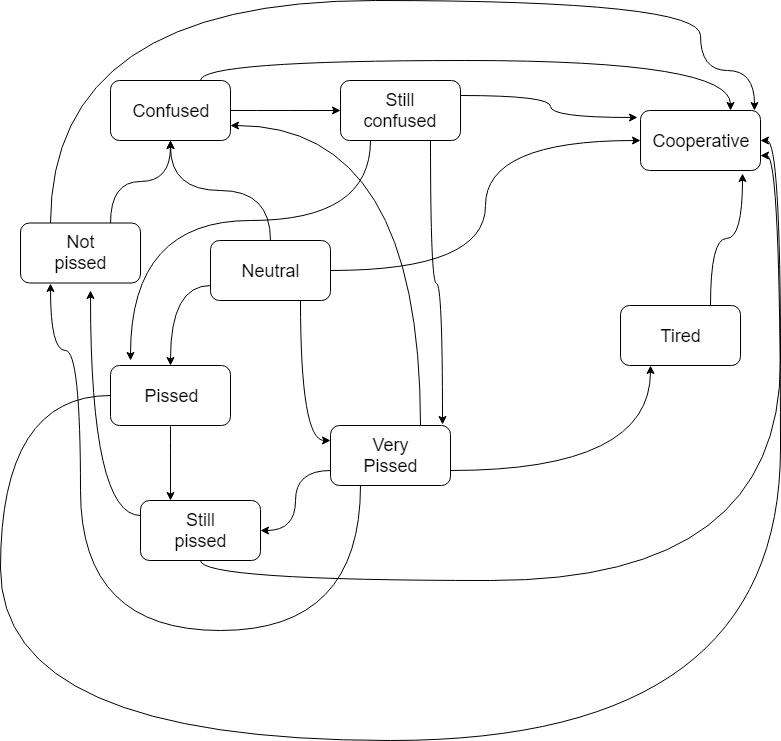

# NPC Test

This project contains the basic code for creating a state machine aimed at changing state depending on an input text from a user using the [Google Natural Language API](https://cloud.google.com/natural-language/?hl=es-419).
This functionality is aimed at a videogame non playable character imitating human behaviour and conversation.

## Installation

In case of using Pipenv, you can install all the necessary packages in the virtual environment with:
```
pipenv install
```

If you are not a fan of virtual environments use:
```
pip install -r requirements.txt
```

You will also need to [set up your Google Cloud Platform project](https://cloud.google.com/natural-language/docs/quickstart-client-libraries?hl=es-419), habilitate the Natural Language API and download a json file with the private key of your credentials in the root folder of this project. Once you have said file, set the PATH variable of settings.py with its name.

## Usage

To run the NPC example execute:
```
python my_npc.py
```

This will start asking the user for inputs until you ask nicely about 'el on¡bjetivo' or 'tire' thee NPC.

If you want to develop and test your own NPC, you could create a new json file and modifiy the NPC_JSON variable of settings.py to reuse the current code. You could also define a new class derivated from NPCStateMachine.

## Functionality

The current implementation of MyNPC updates its state based of the entities mentioned and the sentiment (with a 10% variation) of the user input.


The class also includes unused functions such as attack or bribe to demonstrate that there are other possible actions to trigger a different state. Also, reaction could be modified to include more possible actions of the NPC, such as fighting or running away. The use of randomize and penalize are in order to include randomness and unexpected results into the equation.
